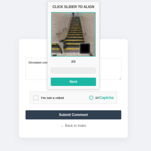

# anCaptcha


A No-JS, stateless captcha engine implemented in Rust for cross-language integration. Originally designed for the darknet, specifically for Tor hidden services, to provide human verification without requiring JavaScript.

## Key Features

- **No-JavaScript**: Challenges are entirely driven by CSS and HTML; no client-side scripts are required for rendering or interaction.
- **Stateless Verification**: Uses authenticated encryption (ChaCha20-Poly1305) to store challenge state in tokens, eliminating the need for server-side sessions.
- **High-Level Wrappers**: Ready-to-use implementations for Go, Python, and PHP are provided in the `examples/` directory. **Note: These are the only three officially supported language wrappers provided.**

## Preview

| Style | Image |
|-------|-------|
| **Rotate** |  |
| **Slider** |  |
| **Pair** |  |

## Architecture

anCaptcha is structured as a workspace with the following core crates:

- **`crates/ancaptcha`**: Core engine handling challenge generation, authenticated encryption, and verification logic.
- **`crates/ancaptcha-ffi`**: C-ABI bridge for multi-language consumption.

## Configuration

The engine is configured through a central `Config` struct (Rust) or via the FFI initialization calls (Wrappers).

Generate a 32-byte hex key for authenticated encryption:
```bash
openssl rand -hex 32
```

### Global Configuration

| Property | Type | Default | Description |
|-----------|------|---------|-------------|
| `secret` | 32-byte | (Required) | Key for authenticated encryption. must be identical across nodes. |
| `difficulty` | Enum | `Medium` | Challenge complexity: `Easy` (1 step), `Medium` (2 steps), `Hard` (3 steps). |
| `noise_intensity` | Enum | `Medium` | Distortion level (`0: Low`, `1: Medium`, `2: High`). |


### Captcha Styles
| Style | Index | Description |
|-------|-------|-------------|
| `Rotate` | `0` | Rotate image to upright position. |
| `Slider` | `1` | Slide puzzle piece into place. |
| `Pair` | `2` | Find the matching image pair. |

### Visual Customization (Theme)
Default values for the `Theme` struct and `anCaptcha_set_theme`:

| Property | Default | Description |
|----------|---------|-------------|
| `background_color` | `#f9f9f9` | Main container background. |
| `border_color` | `#d3d3d3` | Outer border color. |
| `text_color` | `#333333` | Primary text color. |
| `accent_color` | `#14B8A6` | Primary button/checkbox color. |
| `error_color` | `#dc3545` | Error message and invalid state color. |
| `font_family` | (System) | Sans-serif font stack. |

### Structural Customization (Layout)
Default values for the `Layout` struct and `anCaptcha_set_layout`:

| Property | Default | Description |
|----------|---------|-------------|
| `width` | `100%` | Container width. |
| `max_width` | `400px` | Maximum container width. |
| `margin` | `20px auto` | Container margin. |
| `min_height` | `3.5rem` | Initial trigger height. |
| `padding` | `0.5rem 0.9rem` | Container padding. |
| `checkbox_size` | `1.2rem` | Custom checkbox dimensions. |

## Installation

### From Crates.io
```bash
cargo add ancaptcha
```

### From My Registry
Add the registry to your local `.cargo/config.toml`:

```toml
[registries.maverick]
index = "sparse+https://git.mrmave.work/api/packages/maverick/cargo/"

[net]
git-fetch-with-cli = true
```

Then install:
```bash
cargo add ancaptcha --registry maverick
```

## Quick Start (Build from Source)

Requires Linux and Rust.

```bash
# 1. Clone
git clone https://git.mrmave.work/maverick/ancaptcha.git

# Tor
git -c http.proxy=socks5h://127.0.0.1:9050 clone http://mavegitwskioz7tpppmjtj7fn24pwezciii3nvc7kdyltn5iu5uakfqd.onion/ancaptcha

# 2. Build
cd ancaptcha
make build
```

## Custom Assets

You can add your own images by placing them in `crates/ancaptcha/assets/original_images/`. The pipeline converts `.jpg`, `.jpeg`, and `.png` files into optimized 200x200 WebP artifacts (<3.5KB).

```bash
make assets
make build
```

## Download and Verify Artifacts

Pre-built binaries, headers, and signatures are available in the `dist/` directory or via [Releases](https://git.mrmave.work/maverick/ancaptcha/releases).

### 1. Import Public Key

```bash
# WKD
gpg --locate-keys mail@mrmave.work

# OR

# Origin
wget https://git.mrmave.work/maverick/ancaptcha/raw/branch/main/maverick.asc

# Tor
torsocks wget http://mavegitwskioz7tpppmjtj7fn24pwezciii3nvc7kdyltn5iu5uakfqd.onion/ancaptcha/plain/maverick.asc

gpg --import maverick.asc
```

### 2. Download Artifacts

#### libancaptcha_ffi.so
```bash
# Origin
wget https://git.mrmave.work/maverick/ancaptcha/releases/download/v0.1.0/libancaptcha_ffi.so
wget https://git.mrmave.work/maverick/ancaptcha/releases/download/v0.1.0/libancaptcha_ffi.so.sha256
wget https://git.mrmave.work/maverick/ancaptcha/releases/download/v0.1.0/libancaptcha_ffi.so.asc

# Tor
torsocks wget http://mavegitwskioz7tpppmjtj7fn24pwezciii3nvc7kdyltn5iu5uakfqd.onion/ancaptcha/plain/dist/libancaptcha_ffi.so
torsocks wget http://mavegitwskioz7tpppmjtj7fn24pwezciii3nvc7kdyltn5iu5uakfqd.onion/ancaptcha/plain/dist/libancaptcha_ffi.so.sha256
torsocks wget http://mavegitwskioz7tpppmjtj7fn24pwezciii3nvc7kdyltn5iu5uakfqd.onion/ancaptcha/plain/dist/libancaptcha_ffi.so.asc
```

#### ancaptcha-ffi.h
```bash
# Origin
wget https://git.mrmave.work/maverick/ancaptcha/releases/download/v0.1.0/ancaptcha-ffi.h
wget https://git.mrmave.work/maverick/ancaptcha/releases/download/v0.1.0/ancaptcha-ffi.h.sha256
wget https://git.mrmave.work/maverick/ancaptcha/releases/download/v0.1.0/ancaptcha-ffi.h.asc

# Tor
torsocks wget http://mavegitwskioz7tpppmjtj7fn24pwezciii3nvc7kdyltn5iu5uakfqd.onion/ancaptcha/plain/dist/ancaptcha-ffi.h
torsocks wget http://mavegitwskioz7tpppmjtj7fn24pwezciii3nvc7kdyltn5iu5uakfqd.onion/ancaptcha/plain/dist/ancaptcha-ffi.h.sha256
torsocks wget http://mavegitwskioz7tpppmjtj7fn24pwezciii3nvc7kdyltn5iu5uakfqd.onion/ancaptcha/plain/dist/ancaptcha-ffi.h.asc
```

### 3. Verify Artifacts

```bash
# Verify Checksums
sha256sum -c libancaptcha_ffi.so.sha256
sha256sum -c ancaptcha-ffi.h.sha256

# Verify Signatures
gpg --verify libancaptcha_ffi.so.asc libancaptcha_ffi.so
gpg --verify ancaptcha-ffi.h.asc ancaptcha-ffi.h
```

### 4. Language Wrappers (Go, Python, PHP)

Only these three languages are officially supported with pre-built wrappers.

#### Go
```bash
# Origin
wget https://git.mrmave.work/maverick/ancaptcha/raw/branch/main/examples/go/ancaptcha/ancaptcha.go

# Tor
torsocks wget http://mavegitwskioz7tpppmjtj7fn24pwezciii3nvc7kdyltn5iu5uakfqd.onion/ancaptcha/plain/examples/go/ancaptcha/ancaptcha.go
```

#### Python
```bash
# Origin
wget https://git.mrmave.work/maverick/ancaptcha/raw/branch/main/examples/python/ancaptcha.py

# Tor
torsocks wget http://mavegitwskioz7tpppmjtj7fn24pwezciii3nvc7kdyltn5iu5uakfqd.onion/ancaptcha/plain/examples/python/ancaptcha.py
```

#### PHP
```bash
# Origin
wget https://git.mrmave.work/maverick/ancaptcha/raw/branch/main/examples/php/AnCaptcha.php

# Tor
torsocks wget http://mavegitwskioz7tpppmjtj7fn24pwezciii3nvc7kdyltn5iu5uakfqd.onion/ancaptcha/plain/examples/php/AnCaptcha.php
```

## Security and Compliance

The library underwent the following verifications:

- **Dependency Audit**: Verified for known vulnerabilities using `cargo audit`.
- **Licensing/Advisory Check**: Verified compliance using `cargo deny`.
- **Memory Safety**: Audited with Valgrind (`memcheck`) during FFI integration testing. Verified **0 bytes definitely lost** across the C-ABI boundary.
- **Cryptographic Integrity**: Authenticated encryption (ChaCha20-Poly1305) prevents token tampering and enforces strict TTL-based expiration.

## License

(c) 2026 Maverick. Licensed under the Apache-2.0 License.

- **Repository**: `https://git.mrmave.work/maverick/ancaptcha`
- **Tor**: `http://mavegitwskioz7tpppmjtj7fn24pwezciii3nvc7kdyltn5iu5uakfqd.onion/ancaptcha`

## Donation

**Monero (XMR)**: `86FSeePspHNgbS29usjrtudPE1PTP2UjJLhB9vdXp3WjD9EYAibdS171SdT2dmcC7ZC6t9iPYd6StEeiXFNj6YNhRRcQyJi`
